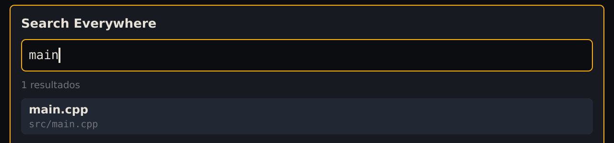
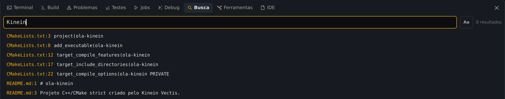
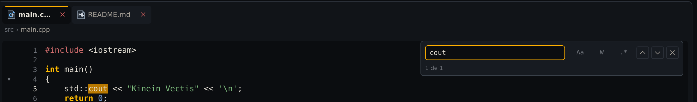
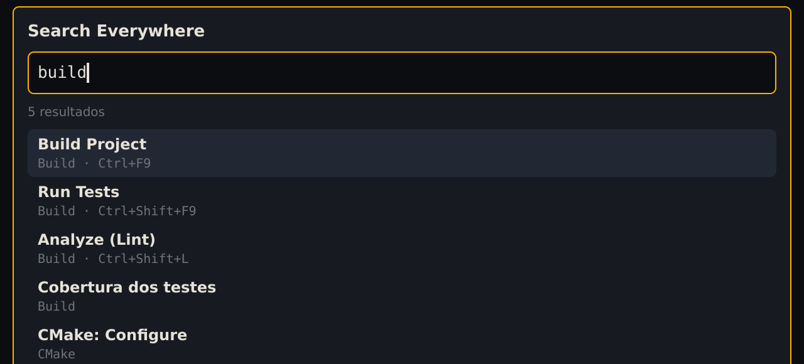

**Seu objetivo:** Escolher a busca certa para encontrar um arquivo, um trecho ou uma ação.

**Pense antes de seguir:** Para encontrar um nome de arquivo, qual busca você escolheria?

A Kinein Vectis tem três buscas: por arquivo, por texto no projeto inteiro e por texto no arquivo aberto. As duas primeiras usam programas do sistema, que você instala primeiro.

## Instale o fd e o ripgrep

O **fd** encontra arquivos pelo nome, e o **ripgrep** procura texto dentro deles:

```bash
sudo apt install fd-find ripgrep
```

No Ubuntu, o comando do fd se chama `fdfind`, e a IDE procura pelos dois nomes. Confira:

```bash
fdfind --version
rg --version | head -n 1
```

Sem o fd, a busca de arquivos não acha nada e avisa `fd nao foi encontrado no PATH`.

## Abra um arquivo pelo nome

Com o `ola-kinein` aberto, aperte <kbd>Ctrl</kbd>+<kbd>Shift</kbd>+<kbd>N</kbd>. É o **Search Everywhere**. Digite parte do nome do arquivo, como `main`:



_Cada resultado mostra o nome e, embaixo, a pasta._

As setas escolhem um resultado, <kbd>Enter</kbd> abre e <kbd>Esc</kbd> fecha.

> **Num projeto Python, na 0.3.5**, a busca também lista os arquivos do `.venv`, e o resultado do seu projeto pode ficar no meio deles. Digite o nome mais completo para filtrar.

## Procure um texto no projeto

<kbd>Ctrl</kbd>+<kbd>Shift</kbd>+<kbd>F</kbd> abre a aba **Busca** do painel de baixo. Digite `Kinein` e aperte <kbd>Enter</kbd>:



_Cada resultado é arquivo:linha seguido do trecho encontrado._

Clicar num resultado abre o arquivo com o cursor naquela linha. Por padrão, a busca não diferencia maiúsculas: `Kinein` também achou `ola-kinein`. O botão **Aa**, ao lado do campo, liga a diferença.

## Procure no arquivo aberto

Com o `main.cpp` no editor, <kbd>Ctrl</kbd>+<kbd>F</kbd> abre uma barra no canto do editor. Digite `cout`:



_A barra conta as ocorrências e destaca cada uma no código._

<kbd>Enter</kbd> vai para a próxima ocorrência e <kbd>Esc</kbd> fecha a barra. Os botões ligam a diferença de maiúsculas (**Aa**), a palavra inteira (**W**) e as expressões regulares (**.\***).

## Ache um comando e o atalho dele

O Search Everywhere também acha os comandos da IDE, cada um com o atalho ao lado. Digite `build`:



_Enter roda o comando escolhido._

> **Na 0.3.5, parte dos comandos tem nome em inglês.** Os de compilar, testar e executar se chamam `Build Project`, `Run Tests` e `Run`: procure por `build` ou `run`, porque `compilar` e `executar` não acham nada. Os do Git estão em português, como `Git: Commit...`.

É um bom jeito de descobrir atalhos: procure o comando e veja a tecla ao lado.

## Os atalhos do Guia

Estes são os atalhos usados nos capítulos até aqui:

| Atalho                                         | O que faz                              |
| ---------------------------------------------- | -------------------------------------- |
| <kbd>Ctrl</kbd>+<kbd>O</kbd>                   | Abrir uma pasta ou criar um projeto    |
| <kbd>Ctrl</kbd>+<kbd>S</kbd>                   | Salvar o arquivo                       |
| <kbd>Ctrl</kbd>+<kbd>Alt</kbd>+<kbd>B</kbd>    | Compilar                               |
| <kbd>Ctrl</kbd>+<kbd>Shift</kbd>+<kbd>F9</kbd> | Rodar os testes                        |
| <kbd>Alt</kbd>+<kbd>F12</kbd>                  | Abrir o terminal                       |
| <kbd>Alt</kbd>+<kbd>7</kbd>                    | Abrir ou fechar os Símbolos            |
| <kbd>Ctrl</kbd>+<kbd>Shift</kbd>+<kbd>N</kbd>  | Search Everywhere: arquivos e comandos |
| <kbd>Ctrl</kbd>+<kbd>Shift</kbd>+<kbd>F</kbd>  | Procurar texto no projeto              |
| <kbd>Ctrl</kbd>+<kbd>F</kbd>                   | Procurar no arquivo aberto             |

A tabela completa está no fim do manual da IDE, em **Ajuda → Manual da IDE**.

## Confira o que aprendeu

Sem reler as etapas, responda:

1. Para encontrar um nome de arquivo, qual busca você escolheria?
2. E para procurar texto em vários arquivos?
3. Como procurar somente dentro do arquivo aberto?

<details>
<summary>Conferir seu raciocínio</summary>

Ctrl+Shift+N encontra arquivos e comandos; Ctrl+Shift+F procura texto no projeto; Ctrl+F procura no arquivo aberto. Na 0.3.5, procure build ou run para os comandos de compilação e execução.

</details>

Se uma resposta ainda não ficou clara, volte à etapa correspondente e confira na IDE. O resultado que você observa vale mais do que decorar um atalho.
