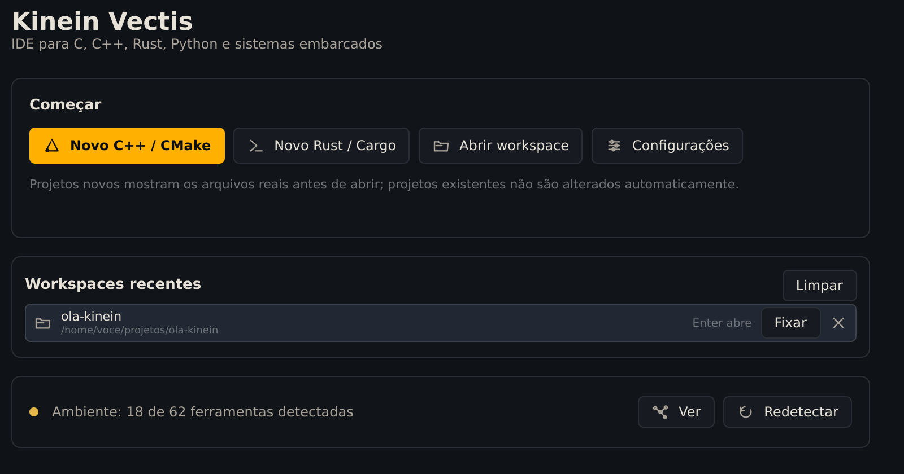
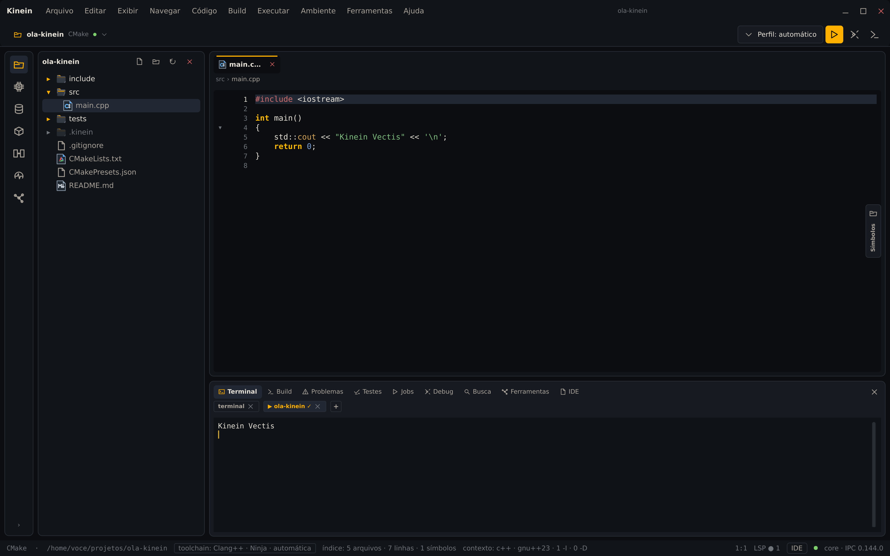
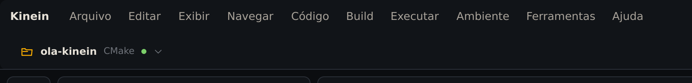
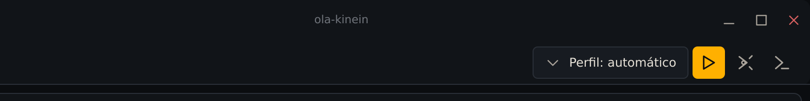
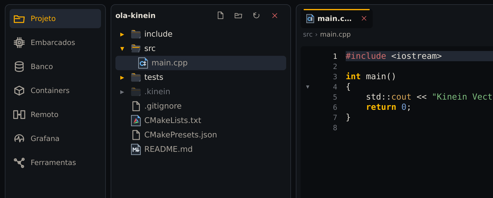
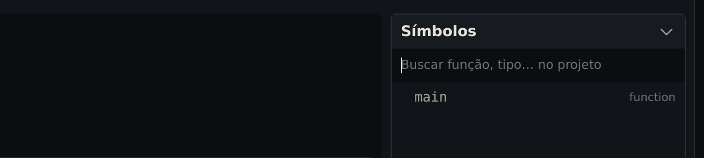
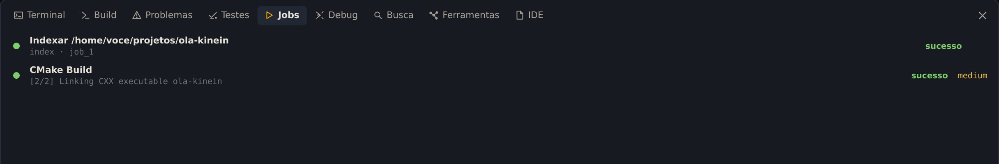
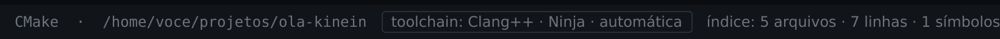
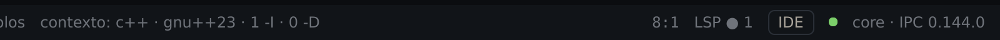

Com um projeto aberto, a janela da Kinein Vectis se divide em poucas partes, sempre no mesmo lugar. Este capítulo passa por cada uma, com o `ola-kinein` do capítulo anterior.

## Abra o projeto de novo

Abra a IDE. Na tela inicial, o projeto está em **Workspaces recentes**:

_Os recentes guardam o caminho de cada projeto._

Clique em **ola-kinein** para abrir. **Fixar** mantém um projeto no topo da lista, o **✕** tira o projeto da lista sem apagar nada do disco, e **Limpar** esvazia a lista.

Pelo terminal, `kinein ~/projetos/ola-kinein` também abre o projeto. Na 0.3.5, esse terminal fica ocupado até você fechar a IDE.

## A tela inteira

Com o `main.cpp` aberto, compilado e executado como no capítulo anterior, a janela fica assim:

_A janela com o projeto aberto, o painel de baixo mostrando a última execução._

De cima para baixo e da esquerda para a direita:

1. **Menu e cabeçalho**, no alto.
2. **Trilho**: a coluna fina de ícones à esquerda.
3. **Árvore do projeto**: as pastas e os arquivos.
4. **Editor**, no centro, com a aba **Símbolos** recolhida na borda direita.
5. **Painel de baixo**: terminal, build, problemas e o resto.
6. **Barra de status**, no pé da janela.

## O alto: menu e cabeçalho

A primeira linha é o menu: **Arquivo**, **Editar**, **Exibir**, **Navegar**, **Código**, **Build**, **Executar**, **Ambiente**, **Ferramentas** e **Ajuda**. Logo abaixo, à esquerda, fica o projeto:

_O nome, o tipo do projeto (CMake) e a seta do menu do projeto._

A seta ao lado do nome abre **Abrir workspace…**, os projetos recentes e **Fechar workspace**. Num projeto com Git, aparece ao lado o nome da branch atual.

À direita ficam as ações de executar:

_Da esquerda para a direita: a configuração de execução, rodar, depurar e o menu de build._

- **Perfil: automático**: o que o **▶** executa. No automático, é o programa do projeto; aqui você pode salvar outros comandos.
- **▶**: roda a configuração ativa.
- O ícone seguinte depura a configuração ativa.
- O último, **>_**, abre o menu de compilar, testar e analisar. Apesar do desenho, ele não abre o terminal.

## À esquerda: o trilho e a árvore

O **›** no pé do trilho mostra o nome de cada ícone, e **‹ recolher** volta ao normal:

_O trilho expandido, ao lado da árvore do projeto._

**Projeto** mostra a árvore de arquivos. Os outros ícones abrem os painéis de placas e microcontroladores (**Embarcados**), bancos de dados (**Banco**), **Containers**, máquinas acessadas por SSH (**Remoto**), **Grafana** e o diagnóstico das ferramentas instaladas (**Ferramentas**). Nenhum deles é necessário para os primeiros projetos.

Na árvore, as pastas do projeto vêm primeiro. Pastas geradas por ferramentas, como `.kinein`, aparecem em cinza.

## No centro: o editor e os Símbolos

Cada arquivo aberto vira uma aba no alto do editor, e logo abaixo dela aparece o caminho do arquivo (`src › main.cpp`).

A aba estreita **Símbolos**, na borda direita, abre com um clique ou com <kbd>Alt</kbd>+<kbd>7</kbd>:

_Sem nada digitado, o painel mostra a estrutura do arquivo aberto._

Com o campo vazio, ele lista o que há no arquivo aberto, aqui a função `main`. Digitando um nome, ele procura funções e tipos no projeto inteiro; clicar no resultado abre o arquivo na linha certa.

## Embaixo: o painel e a barra de status

O painel de baixo tem uma aba para cada tipo de saída: **Terminal**, **Build**, **Problemas**, **Testes**, **Jobs**, **Debug**, **Busca**, **Ferramentas** e **IDE**. Clicar na aba que já está aberta recolhe o painel.

A aba **Jobs** guarda o histórico do que a IDE rodou em segundo plano:

_A indexação do projeto e o build, os dois com sucesso._

O **medium** em laranja é o nível de risco que a IDE dá ao trabalho: um build escreve arquivos dentro do projeto. Trabalhos de risco baixo não mostram rótulo.

A barra de status, no pé da janela, resume o estado do projeto. À esquerda:

_Tipo e caminho do projeto, o compilador escolhido e o índice._

- O tipo e o caminho do projeto.
- **toolchain**: o compilador que a IDE detectou e o gerador do build. Atenção: na 0.3.5 esse rótulo não é necessariamente o compilador que o CMake usa. Nesta reprodução aparece Clang++, porque o Clang estava instalado, mas o build usou o GCC, o compilador padrão do sistema (`c++`).
- **índice**: o tamanho do índice que a IDE monta do projeto, usado pela busca e pelos Símbolos.

À direita:

_O contexto de compilação do arquivo, a posição do cursor, os servidores de linguagem e o core._

- **contexto**: como o arquivo aberto é compilado: a linguagem, o padrão (`gnu++23`) e quantos caminhos de include (`-I`) e definições (`-D`) ele recebe.
- A posição do cursor, linha e coluna.
- **LSP**: os servidores de linguagem rodando, que dão o autocompletar e os avisos. Uma bolinha com um número é o normal; um **✗** vermelho quer dizer que um deles parou, e passar o mouse mostra o motivo.
- **IDE** abre a aba IDE do painel, com o registro técnico do que a interface está fazendo. É útil para relatar um problema.
- **core**: o processo que faz o trabalho pesado da IDE. A bolinha verde quer dizer conectado.
