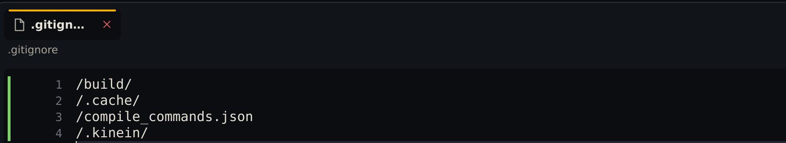
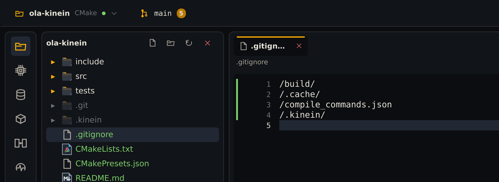
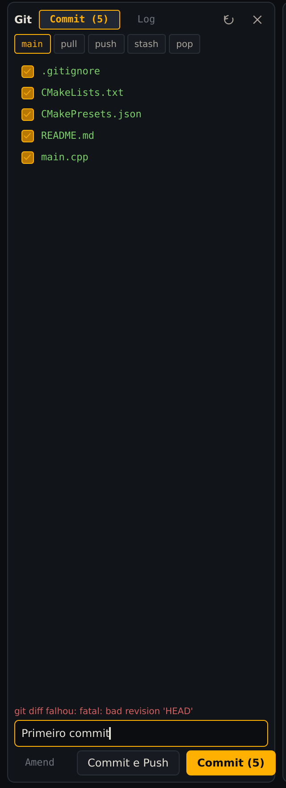
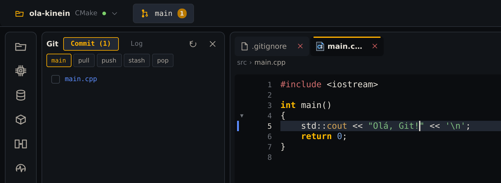
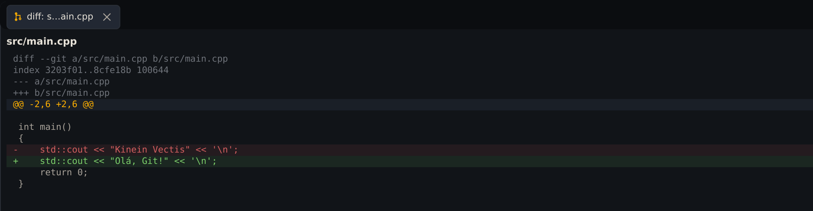
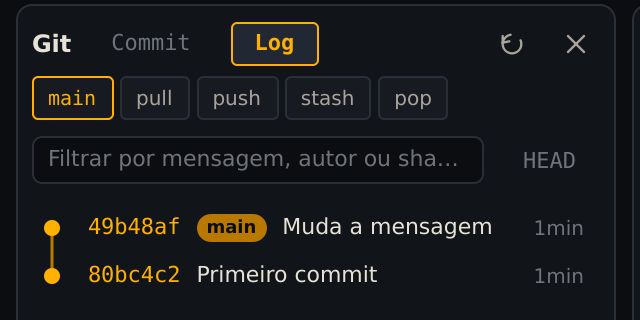
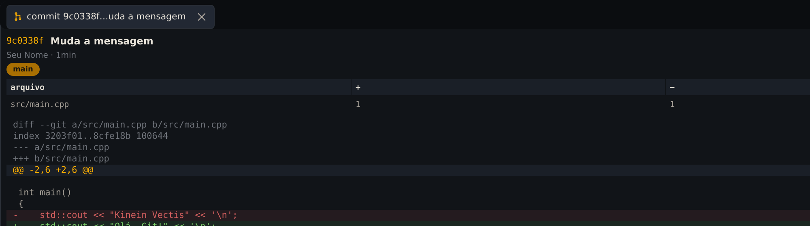

**Seu objetivo:** Guardar duas versões do projeto e explicar a diferença entre elas.

**Pense antes de seguir:** Um commit envia o projeto automaticamente para o GitHub?

O Git guarda versões do projeto: cada **commit** é uma fotografia dos arquivos, com uma mensagem dizendo o que mudou. A Kinein Vectis mostra o estado do Git na árvore, no editor e numa janela própria. Neste capítulo, o `ola-kinein` vira um repositório.

## Instale o Git e diga quem você é

```bash
sudo apt install git
git config --global user.name "Seu Nome"
git config --global user.email "voce@example.com"
git config --global init.defaultBranch main
```

As duas primeiras configurações vão em cada commit seu; use o seu nome e o seu e-mail. A terceira dá o nome `main` à branch principal dos repositórios novos. Confira a instalação:

```bash
git --version
```

## Crie o repositório

No terminal:

```bash
cd ~/projetos/ola-kinein
git init
```

A resposta começa com `Initialized empty Git repository`. Na 0.3.5, a IDE ainda não mostra nada: ela percebe o repositório novo na próxima vez que um arquivo do projeto muda, e é o que vai acontecer no passo seguinte. Para atualizar na hora, use **Git: Atualizar status** no <kbd>Ctrl</kbd>+<kbd>Shift</kbd>+<kbd>N</kbd>.

## Diga ao Git o que ignorar

Antes do primeiro commit, decida o que **não** deve entrar no repositório. O `.gitignore` do projeto já ignora pastas de build, mas na 0.3.5 falta a pasta `.kinein`, onde a IDE guarda o build e os dados dela. Sem essa linha, o primeiro commit levaria o executável e centenas de arquivos gerados.

Abra o `.gitignore` na árvore e acrescente, no fim, a linha `/.kinein/`. Salve com <kbd>Ctrl</kbd>+<kbd>S</kbd>:



_A quarta linha é a que você acrescentou._

Ao salvar, a IDE passa a mostrar o repositório:



_Verde na árvore: arquivos novos, que o Git ainda não guarda. O 5 conta as mudanças._

## Faça o primeiro commit

Clique em **main**, no cabeçalho. A janela do Git abre no lugar da árvore, na aba **Commit**, com a lista do que mudou. Marque a caixinha de cada arquivo, escreva a mensagem embaixo e clique em **Commit (5)**:



_Só o que está marcado entra no commit._

> **O aviso vermelho antes do primeiro commit.** Na 0.3.5, um repositório ainda sem commits mostra `git diff falhou: fatal: bad revision 'HEAD'`. É só porque ainda não existe um commit para comparar; o commit funciona normalmente.

Depois do commit, a lista fica vazia e o número some do cabeçalho.

## Mude, compare e faça outro commit

A janela do Git ocupa o lugar da árvore. Para abrir o `main.cpp`, use <kbd>Ctrl</kbd>+<kbd>Shift</kbd>+<kbd>N</kbd>, como no capítulo anterior. Troque o texto entre aspas por `Olá, Git!` e salve:



_Azul: arquivo e linha modificados desde o último commit._

Clique no nome do arquivo na janela do Git para ver exatamente o que mudou:



_Vermelho saiu, verde entrou. Esc volta ao editor._

Aperte <kbd>Esc</kbd>, marque o `main.cpp`, escreva `Muda a mensagem` e clique em **Commit (1)**.

## Veja o histórico

Na janela do Git, a aba **Log** lista os commits, do mais novo para o mais antigo:



_O selo main marca onde a branch está agora._

Clique num commit para ver, no editor, quem fez, quais arquivos mudaram e o que mudou em cada um:



_Os detalhes do último commit._

Pelo terminal, o mesmo histórico:

```bash
cd ~/projetos/ola-kinein
git log --oneline
```

As duas linhas são os seus commits, o mais novo em cima.

## Confira o que aprendeu

Sem reler as etapas, responda:

1. Um commit envia o projeto automaticamente para o GitHub?
2. Por que ignorar .kinein antes do primeiro commit?
3. O que o diff permite conferir antes de salvar uma versão?

<details>
<summary>Conferir seu raciocínio</summary>

Um commit guarda uma versão no repositório local; não faz push. Ignorar .kinein evita guardar build e estado local da IDE. O diff mostra as linhas removidas e adicionadas, para conferir o que entrará no commit.

</details>

Se uma resposta ainda não ficou clara, volte à etapa correspondente e confira na IDE. O resultado que você observa vale mais do que decorar um atalho.
