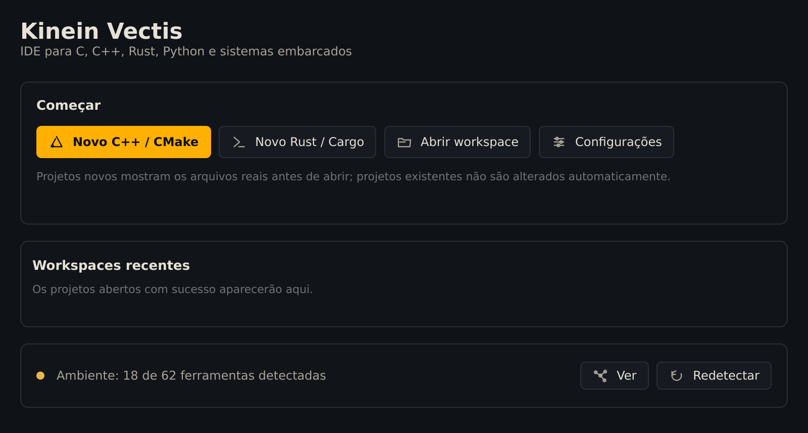

A Kinein Vectis é distribuída como um **AppImage**: um único arquivo executável que já traz a interface, o core e o Qt. Não há instalação de pacote nem `sudo`. Compiladores e ferramentas dos seus projetos continuam vindo do sistema.

## Confira o computador

Abra um terminal e rode:

```bash
uname -m
ldd --version | head -n 1
```

A primeira linha precisa ser `x86_64`. A segunda mostra a versão da glibc, que precisa ser 2.36 ou mais nova. No Ubuntu 24.04, por exemplo, aparece `ldd (Ubuntu GLIBC 2.39-0ubuntu8.7) 2.39`.

## Baixe o pacote

O pacote `KV0.3.zip` traz uma pasta com o AppImage, o arquivo de verificação, o instalador e uma cópia do tutorial. Guarde-o numa pasta permanente, e não em Downloads: o atalho vai apontar para esse lugar.

```bash
mkdir -p ~/Applications
cd ~/Applications
curl -LO https://github.com/ViktorWalde/KineinVectis/releases/download/v0.3.5/KV0.3.zip
unzip -o KV0.3.zip
```

O `unzip` lista os arquivos extraídos para `~/Applications/KV0.3/`. Se preferir o navegador, baixe o `KV0.3.zip` na [página da versão](https://github.com/ViktorWalde/KineinVectis/releases/tag/v0.3.5) e extraia no mesmo lugar.

## Confira se o arquivo chegou íntegro

O arquivo `.sha256` guarda a impressão digital do AppImage. Compare as duas antes de executar qualquer coisa:

```bash
cd ~/Applications/KV0.3
sha256sum -c Kinein-Vectis-0.3.5-x86_64.AppImage.sha256
```

Só continue se a resposta for:

```text
Kinein-Vectis-0.3.5-x86_64.AppImage: OK
```

> Se aparecer `FAILED`, não execute o arquivo. Apague a pasta, baixe de novo e repita a verificação.

## Instale o atalho e o comando kinein

O instalador cria o item **Kinein Vectis** no menu de aplicativos e o comando `kinein` para abrir pastas pelo terminal. Ele não usa `sudo` e só escreve na sua pasta pessoal.

```bash
cd ~/Applications/KV0.3
chmod +x instalar-kinein-vectis.sh
./instalar-kinein-vectis.sh
```

A saída confirma o atalho e o comando (aqui, numa conta chamada `voce`):

```text
==> usando a versão mais recente
/home/voce/Applications/KV0.3/Kinein-Vectis-0.3.5-x86_64.AppImage
==> atalho instalado/atualizado
/home/voce/.local/share/applications/kinein-vectis.desktop
O menu agora abre: Kinein-Vectis-0.3.5-x86_64.AppImage
==> comando curto: /home/voce/.local/bin/kinein
    kinein          abre a pasta atual
    kinein <pasta>  abre outra pasta
```

Se a pasta `~/.local/bin` ainda não estiver no seu `PATH`, como numa conta recém-criada, o instalador acrescenta um aviso com a linha a usar.

Confira se o comando responde:

```bash
kinein --version
```

A resposta é `kinein-vectis 0.3.5`. Se o terminal disser que não encontrou o comando, abra um terminal novo. Se continuar, acrescente ao `PATH` a linha que o instalador mostrou: `export PATH="$HOME/.local/bin:$PATH"`.

## Abra a IDE

Procure **Kinein Vectis** no menu de aplicativos e abra. Sem um projeto escolhido, a IDE começa pela tela inicial:



_A tela inicial da 0.3.5, aberta pela primeira vez._

Ela tem três partes:

- **Começar**: criar um projeto C++ com CMake ou Rust com Cargo, abrir uma pasta que já existe (**Abrir workspace**, ou <kbd>Ctrl</kbd>+<kbd>O</kbd>) e as configurações.
- **Workspaces recentes**: os projetos que você abrir aparecem aqui, para voltar com um clique.
- **Ambiente**: quantas ferramentas a IDE encontrou na máquina (compiladores, CMake, Git, language servers…). O número depende do que está instalado; **Ver** mostra a lista e o que falta.

Pelo terminal, `kinein` abre a pasta em que você está, e `kinein ~/projetos/meu-projeto` abre outra.

> **Se algo der errado.** Erro de FUSE ao abrir: rode `APPIMAGE_EXTRACT_AND_RUN=1 ./Kinein-Vectis-0.3.5-x86_64.AppImage`, que dispensa a montagem. `Permission denied`: repita o `chmod +x` e confira se a pasta não está numa partição montada com `noexec`. Ao abrir pelo terminal no Wayland, a 0.3.5 mostra o aviso `Failed to load client buffer integration: "wayland-egl"`; ele é esperado nesta versão e a IDE funciona normalmente.
