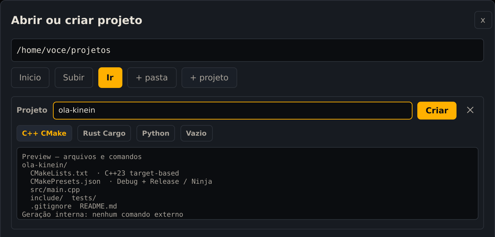
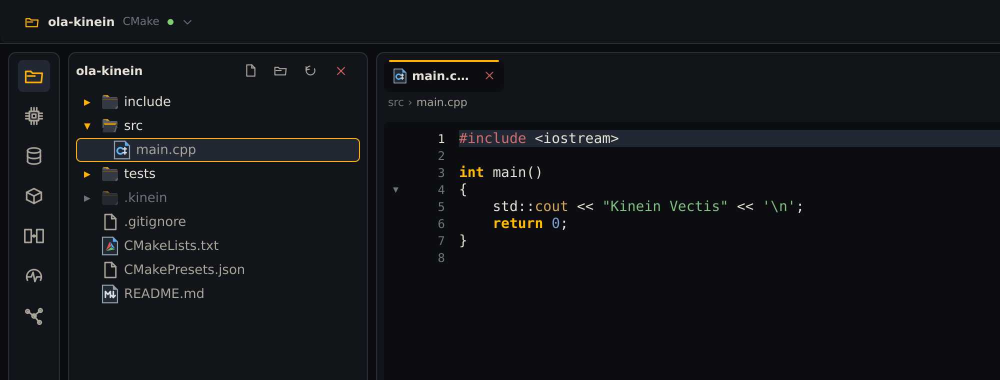
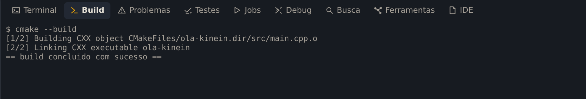
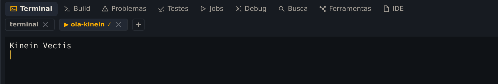
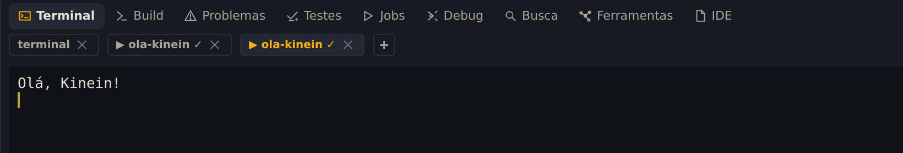

**Seu objetivo:** Criar, compilar e executar um programa, depois conferir uma mudança na saída.

**Pense antes de seguir:** Se mudar o texto e apertar ▶ sem recompilar, qual saída espera ver na 0.3.5?

A Kinein Vectis não traz compilador: ela usa o que está instalado no sistema. Neste capítulo você instala as ferramentas de C++, cria um projeto pela IDE, compila, executa e faz a primeira mudança.

## Instale o compilador e o CMake

No Ubuntu, um comando instala o compilador (GCC), o CMake, o Ninja, que é quem executa o build, e o clangd, que dá à IDE o autocompletar e os avisos enquanto você digita:

```bash
sudo apt install build-essential cmake ninja-build clangd
```

Confira se tudo responde:

```bash
g++ --version | head -n 1
cmake --version | head -n 1
ninja --version
```

As três linhas mostram versões, como `cmake version 3.28.3`. O projeto que a IDE cria pede o CMake 3.24 ou mais novo; o do Ubuntu 24.04 serve.

Se a IDE já estava aberta, feche e abra de novo para ela encontrar as ferramentas novas.

## Crie o projeto

Na tela inicial, clique em **Novo C++ / CMake**. Abre a caixa **Abrir ou criar projeto**, já na sua pasta pessoal.

Guarde os projetos numa pasta só para eles:

1. Clique em **+ pasta**, digite `projetos` e clique em **Criar**.
2. Dê dois cliques em **projetos** para entrar nela.
3. Clique em **+ projeto** e digite o nome: `ola-kinein`.

O tipo **C++ CMake** já vem marcado, e a caixa mostra os arquivos que vão ser criados antes de criar qualquer coisa:



_A prévia lista os arquivos; a criação é feita pela própria IDE, sem rodar comando externo._

Clique em **Criar**. A IDE cria a pasta, abre o projeto e, sozinha, roda o **configure** do CMake: o passo que prepara o build. O andamento aparece na aba **Jobs** do painel de baixo.

## Conheça o que foi criado

Na árvore à esquerda, abra `src` e clique em `main.cpp`:



_O projeto recém-criado, com o main.cpp aberto._

O que cada item é:

- `src/main.cpp`: o programa. Ele imprime `Kinein Vectis`.
- `CMakeLists.txt`: a receita do build. Pede C++23 e liga os avisos do compilador no máximo, tratando aviso como erro (`-Werror`): um aviso impede o build até ser corrigido.
- `CMakePresets.json`: as configurações **Debug**, para desenvolver, e **Release**, otimizada.
- `include/` e `tests/`: vazias, para os seus cabeçalhos e testes.
- `.kinein/`: a pasta da IDE nesse projeto. O build sai em `.kinein/build`.

## Compile

Aperte <kbd>Ctrl</kbd>+<kbd>Alt</kbd>+<kbd>B</kbd>, ou use o menu **Build → Compilar**. A aba **Build** mostra o comando e o resultado:



_Duas etapas: compilar o main.cpp e gerar o executável._

## Execute

Primeiro abra o terminal integrado com <kbd>Alt</kbd>+<kbd>F12</kbd>. Depois clique no botão **▶** laranja, no alto à direita, ou use **Executar → Executar**.

O programa roda numa aba própria do Terminal, com o nome dele. Quando termina, a aba fica com **✓** no nome e a saída continua lá para você ler:



_Ao lado do shell, a aba da execução; o ✓ diz que o programa terminou sem erro._

> **Por que abrir o terminal antes.** Na 0.3.5, se nenhum terminal estiver aberto, a aba da execução fecha assim que o programa termina, e um programa rápido como este parece não ter rodado. Com um terminal aberto, a aba fica.

## Mude o código e rode de novo

No `main.cpp`, troque o texto entre aspas por `Olá, Kinein!`:

```cpp
    std::cout << "Olá, Kinein!" << '\n';
```

Salve com <kbd>Ctrl</kbd>+<kbd>S</kbd>. A IDE também salva sozinha dois segundos depois que você para de digitar.

Agora compile de novo (<kbd>Ctrl</kbd>+<kbd>Alt</kbd>+<kbd>B</kbd>) e execute (**▶**). A aba nova mostra o texto novo:



_A segunda execução, depois de compilar a mudança._

> **Compile antes de executar.** Na 0.3.5, o **▶** roda o executável que já existe; ele não compila antes. Se você mudar o código e executar sem compilar, vai ver a saída antiga.

O executável é um arquivo comum. Pelo terminal, ele roda do mesmo jeito:

```bash
cd ~/projetos/ola-kinein
./.kinein/build/ola-kinein
```

A resposta é `Olá, Kinein!`.

## Confira o que aprendeu

Sem reler as etapas, responda:

1. Se mudar o texto e apertar ▶ sem recompilar, qual saída espera ver na 0.3.5?
2. Qual painel confirma que a compilação terminou?
3. Por que a aba da execução precisa continuar aberta?

<details>
<summary>Conferir seu raciocínio</summary>

Na 0.3.5, o ▶ pode executar o binário anterior: salve e compile antes de rodar. O painel Build informa o resultado da compilação. Abrir antes um terminal mantém a saída de um programa rápido disponível para leitura.

</details>

Se uma resposta ainda não ficou clara, volte à etapa correspondente e confira na IDE. O resultado que você observa vale mais do que decorar um atalho.
