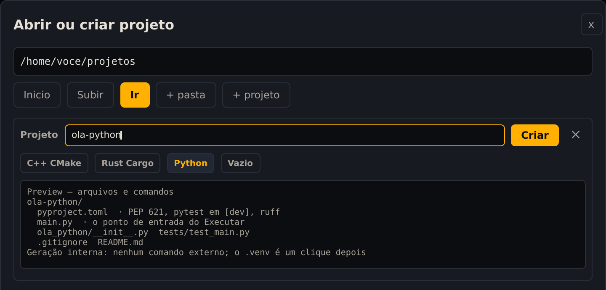
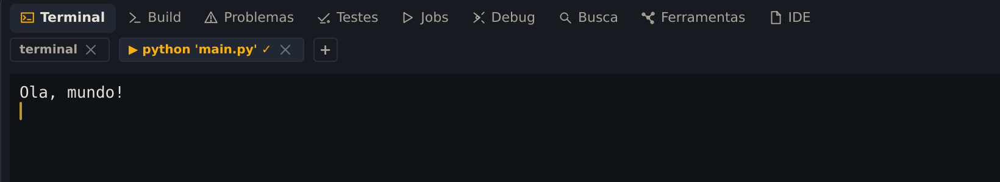
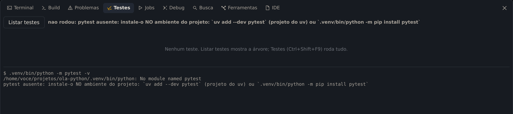
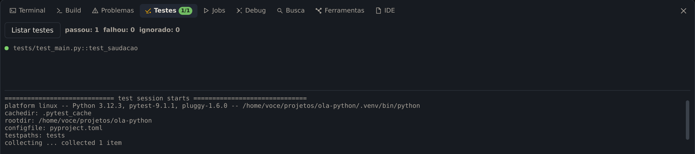

**Seu objetivo:** Executar um projeto no seu ambiente próprio e conferir um teste passando.

**Pense antes de seguir:** Em qual Python o pytest deve ser instalado?

O Ubuntu 24.04 já vem com o Python 3.12. Neste capítulo você instala o que a Kinein Vectis usa em volta dele, cria um projeto, dá a ele um ambiente próprio e roda o programa e os testes.

## Instale o que falta

```bash
sudo apt install python3-venv pipx
pipx install basedpyright
```

- `python3-venv` cria ambientes isolados para cada projeto, as pastas `.venv`.
- `pipx` instala programas escritos em Python sem misturá-los com o Python do sistema.
- `basedpyright` é o servidor de linguagem do Python: o autocompletar e os avisos da IDE.

Confira:

```bash
python3 --version
basedpyright --version
```

Nesta reprodução, a primeira linha foi `Python 3.12.3`; a sua pode mostrar outra atualização do Python 3.12. A segunda mostra a versão do basedpyright. Se o terminal não encontrar o `basedpyright`, rode `pipx ensurepath` e abra um terminal novo.

## Crie o projeto

A tela inicial não tem um botão de Python. Use **Abrir workspace**, ou <kbd>Ctrl</kbd>+<kbd>O</kbd>. Na caixa, entre em **projetos**, clique em **+ projeto**, digite `ola-python` e marque o tipo **Python**:



_O projeto Python, também gerado pela própria IDE._

Clique em **Criar**. O projeto vem com:

- `main.py`: o programa, que o **▶** executa.
- `ola_python/`: o pacote com a função `saudacao`, que o `main.py` usa.
- `tests/test_main.py`: um teste para essa função.
- `pyproject.toml`: o nome do projeto, a versão mínima do Python e o pytest como ferramenta de desenvolvimento.

## Dê ao projeto um ambiente próprio

Abra o `main.py`. No pé da janela, a barra de status mostra qual Python o projeto está usando:


_Sem ambiente próprio, a IDE usa o Python do sistema e avisa em amarelo._

O aviso tem motivo: instalar pacotes no Python do sistema pode quebrar programas do próprio Ubuntu. Cada projeto deve ter o seu ambiente, a pasta `.venv`. Num terminal, o da IDE (<kbd>Alt</kbd>+<kbd>F12</kbd>) ou qualquer outro, crie:

```bash
cd ~/projetos/ola-python
python3 -m venv .venv
```

> **Na 0.3.5, reabra o projeto.** A prévia do projeto fala em criar o `.venv` com um clique, mas esse botão não aparece em projetos só de Python nesta versão. E a IDE só percebe o `.venv` novo quando o projeto é aberto de novo: clique na seta ao lado do nome do projeto, escolha **Fechar workspace** e abra o **ola-python** pelos recentes.

Depois de reabrir, a barra mostra o ambiente do projeto:


_Agora o projeto usa o Python do .venv._

## Execute

Abra o terminal com <kbd>Alt</kbd>+<kbd>F12</kbd>, como nos capítulos anteriores, e clique no **▶**. A IDE roda o `main.py` com o Python do `.venv`:



_A aba da execução leva o comando no nome._

## Rode os testes

Aperte <kbd>Ctrl</kbd>+<kbd>Shift</kbd>+<kbd>F9</kbd>, ou use **Build → Testes**. Na primeira vez, a aba **Testes** explica por que não rodou e qual é o comando:



_O pytest precisa estar no ambiente do projeto, não no sistema._

Instale o pytest no `.venv`, com o comando que a IDE sugeriu:

```bash
cd ~/projetos/ola-python
.venv/bin/python -m pip install pytest
```

Rode os testes de novo (<kbd>Ctrl</kbd>+<kbd>Shift</kbd>+<kbd>F9</kbd>):



_A aba mostra cada caso com o resultado, e a contagem aparece também no nome da aba._

Pelo terminal, o mesmo teste:

```bash
cd ~/projetos/ola-python
.venv/bin/python -m pytest
```

O resumo termina com `1 passed`.

## Confira o que aprendeu

Sem reler as etapas, responda:

1. Em qual Python o pytest deve ser instalado?
2. Como conferir se a IDE reconheceu o .venv?
3. O que fazer se a aba Testes disser que pytest está ausente?

<details>
<summary>Conferir seu raciocínio</summary>

Instale pytest no .venv do projeto, usando .venv/bin/python -m pip install pytest. Na 0.3.5, reabra o workspace depois de criar o ambiente e confira a barra de status. Rode os testes de novo e leia o resultado de cada caso.

</details>

Se uma resposta ainda não ficou clara, volte à etapa correspondente e confira na IDE. O resultado que você observa vale mais do que decorar um atalho.
