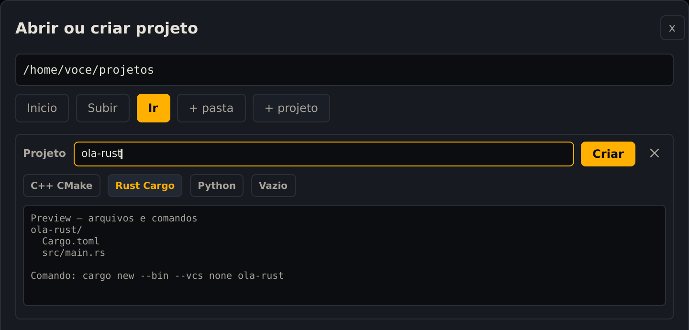
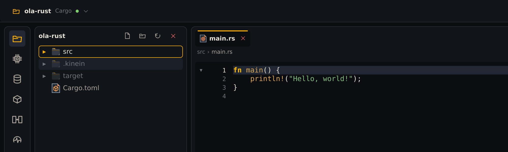
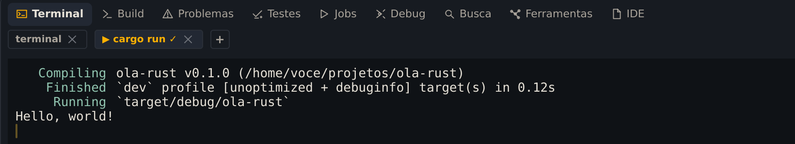
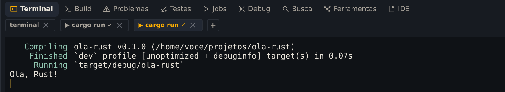

Assim como no C++, a Kinein Vectis usa o Rust instalado no sistema. Para Rust, ela recomenda o **rustup**, o instalador oficial das versões do Rust, junto com o **rust-analyzer**, que dá à IDE o autocompletar e os avisos.

## Instale o Rust

O Ubuntu 24.04 tem o rustup no gerenciador de pacotes:

```bash
sudo apt install rustup
```

O rustup ainda não traz nenhuma versão do Rust. Peça a estável mais recente e o rust-analyzer:

```bash
rustup default stable
rustup component add rust-analyzer
```

Tudo fica em `~/.rustup`, na sua pasta pessoal: cerca de 1,6 GB nesta reprodução. Confira:

```bash
cargo --version
rust-analyzer --version
cargo clippy --version
```

Cada linha mostra uma versão. Nesta reprodução, a estável era a `1.99.0`. O **Clippy**, que a IDE usa na análise de código, já vem junto.

O site do Rust, em rust-lang.org, tem outro instalador do rustup; os comandos `rustup` acima valem para os dois.

## Crie o projeto

Na tela inicial, clique em **Novo Rust / Cargo**. Na caixa **Abrir ou criar projeto**, dê dois cliques em **projetos**, clique em **+ projeto** e digite `ola-rust`:



_No Rust, quem cria o projeto é o próprio Cargo, com o comando mostrado na prévia._

Clique em **Criar**. Diferente do C++, a prévia mostra um comando: a IDE chama o `cargo new`, a ferramenta oficial do Rust para isso. O `--vcs none` diz para não criar um repositório Git.

Abra `src` e clique em `main.rs`:



_O projeto Cargo recém-criado. No alto à direita, o seletor de execução mostra Cargo: debug._

O projeto tem só dois arquivos:

- `Cargo.toml`: o nome, a versão e, mais tarde, as dependências do projeto.
- `src/main.rs`: o programa, que imprime `Hello, world!`.

## Execute

Como no capítulo 2, abra antes o terminal com <kbd>Alt</kbd>+<kbd>F12</kbd>, para a aba da execução ficar depois que o programa termina. Depois clique no **▶**.

No Rust, o **▶** roda `cargo run`, que compila o que mudou e executa em seguida. A aba mostra as duas coisas:



_Compiling, Finished e Running são do Cargo; a última linha é o programa._

A pasta `target`, onde o Cargo guarda o que compila, aparece logo que o projeto abre. Na primeira execução surge também o `Cargo.lock`, que registra as versões exatas das dependências.

## Mude o código e rode de novo

No `main.rs`, troque `Hello, world!` por `Olá, Rust!`:

```rust
    println!("Olá, Rust!");
```

Salve com <kbd>Ctrl</kbd>+<kbd>S</kbd> e clique no **▶** de novo. Não precisa compilar antes: o `cargo run` percebe a mudança e compila sozinho.



_A segunda execução já mostra o texto novo._

Pelo terminal, o mesmo comando faz o mesmo:

```bash
cd ~/projetos/ola-rust
cargo run
```

A última linha é `Olá, Rust!`.
