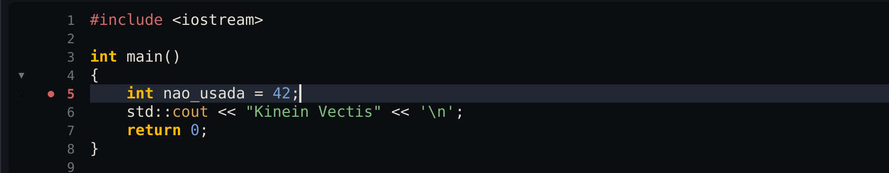
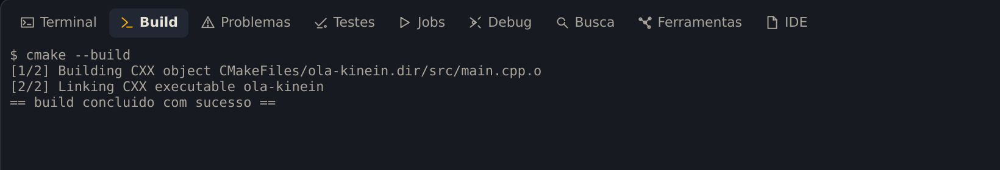
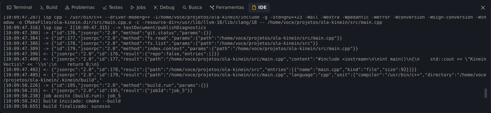

**Seu objetivo:** Ler a origem de um erro, corrigir a linha e confirmar que o build voltou a passar.

**Pense antes de seguir:** Por que uma variável não usada impede este build?

Erros fazem parte do trabalho. Este capítulo provoca um de propósito, mostra onde a Kinein Vectis o aponta e termina com o que levar quando o problema é da IDE.

## Provoque um erro

No `main.cpp` do `ola-kinein`, acrescente uma linha logo depois da chave da função `main`:

```cpp
    int nao_usada = 42;
```

Salve. Em poucos segundos, o número da linha fica vermelho, com um ponto na calha:



_O servidor de linguagem já avisa, antes de qualquer build._

Quem avisa é o clangd, o servidor de linguagem do C++: ele analisa o código enquanto você edita.

## Leia o erro na aba Problemas

Compile com <kbd>Ctrl</kbd>+<kbd>Alt</kbd>+<kbd>B</kbd>. O build falha, e a IDE abre sozinha a aba **Problemas**:

![A aba Problemas com dois itens na linha 5 do main.cpp: o aviso do clangd, Unused variable nao_usada, com o botão Ações, e o erro do compilador, unused variable nao_usada [-Werror=unused-variable]](./capturas/problemas.png)

_Dois itens para a mesma linha: o aviso do clangd e o erro do compilador._

Uma variável que nunca é usada é só um aviso para o compilador. Ela vira erro aqui porque o projeto trata aviso como erro: é o `-Werror` do `CMakeLists.txt`, visto no capítulo 2, e é isso que o `[-Werror=unused-variable]` diz.

O botão **Ações** aparece quando o servidor de linguagem oferece uma correção automática; é o mesmo que <kbd>Alt</kbd>+<kbd>Enter</kbd> na linha.

## Vá à linha e corrija

Clique no erro: o editor vai para a linha 5, com o cursor na variável. Apague a linha com <kbd>Ctrl</kbd>+<kbd>Y</kbd>, salve e compile de novo:



_Sem a variável, o build volta a passar._

## Onde a IDE conta o que fez

Quando o problema não é o seu código, mas a própria IDE, três lugares ajudam:

- A aba **Jobs** guarda cada trabalho que a IDE rodou, com o resultado.
- A aba **IDE** mostra o registro técnico ao vivo: o que a interface pediu, o que o core respondeu e o que os servidores de linguagem escreveram. O botão **IDE** da barra de status também abre essa aba.
- Quando a IDE registra um erro, ele também vai para o arquivo `~/.cache/kinein-vectis/logs/kinein-ui-erros.txt`, que continua lá depois que você fecha a IDE.



_As últimas linhas registram o build que acabou de passar._

Na barra de status, um **LSP ✗** em vermelho quer dizer que um servidor de linguagem não está rodando, e a aba **Ferramentas** lista o que a IDE encontrou na máquina, com a versão de cada programa ou o motivo de não funcionar.

Os problemas do AppImage em si, como o erro de FUSE, estão no fim do capítulo [Instalar e abrir](../instalar/).

## Relate o problema

Se a IDE fez algo errado, conte no [Discord da Kinein Vectis](https://discord.gg/cWRkUGUmQU). Leve:

- o que você fez, o que esperava e o que aconteceu;
- a versão, que `kinein --version` mostra;
- a distribuição Linux e o tipo do projeto: C/C++, Rust, Python ou embarcado, e qual placa;
- o arquivo `kinein-ui-erros.txt`, se existir, e as últimas linhas da aba IDE.

## Confira o que aprendeu

Sem reler as etapas, responda:

1. Por que uma variável não usada impede este build?
2. Qual é a diferença entre o aviso do clangd e o erro do compilador?
3. O que levar ao relatar um problema da IDE?

<details>
<summary>Conferir seu raciocínio</summary>

Este projeto usa -Werror, que trata avisos como erros. O clangd analisa durante a edição; o compilador responde durante o build. Relate versão, sistema, passos, resultado esperado e observado, com logs úteis sem dados pessoais.

</details>

Se uma resposta ainda não ficou clara, volte à etapa correspondente e confira na IDE. O resultado que você observa vale mais do que decorar um atalho.
